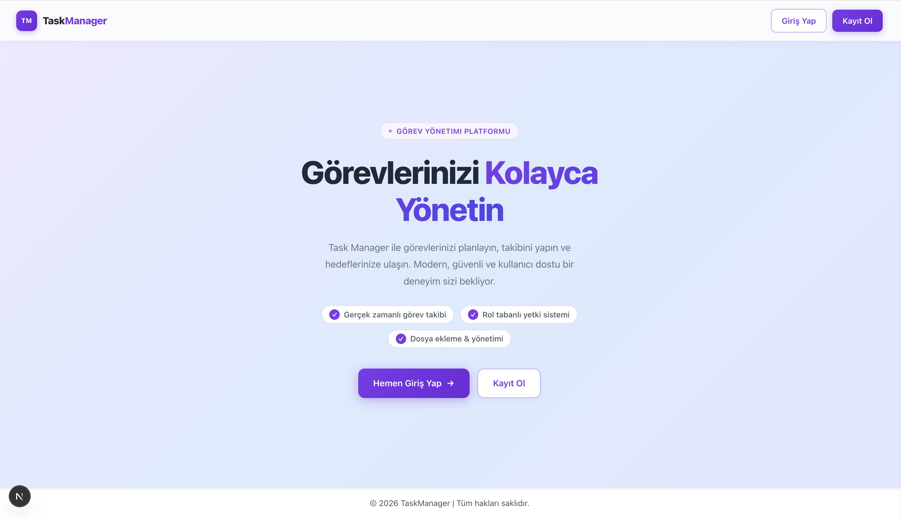
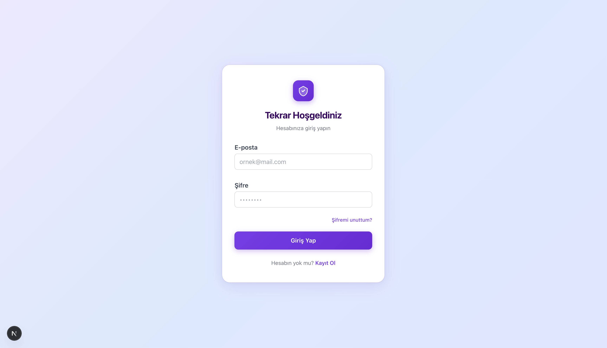
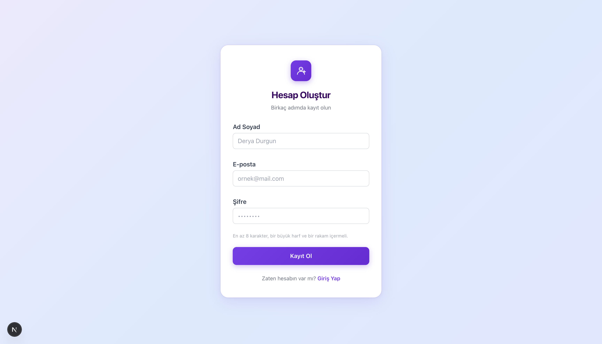
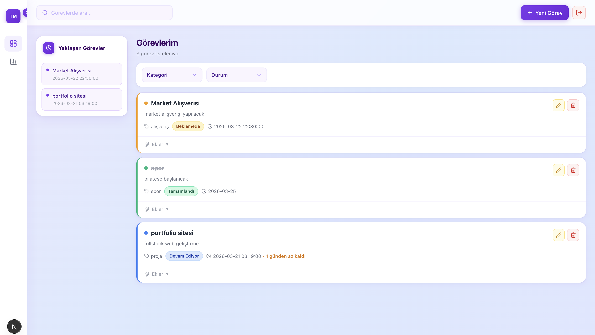
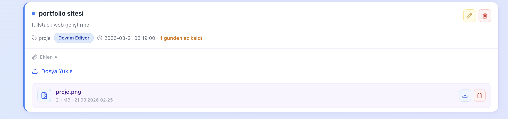
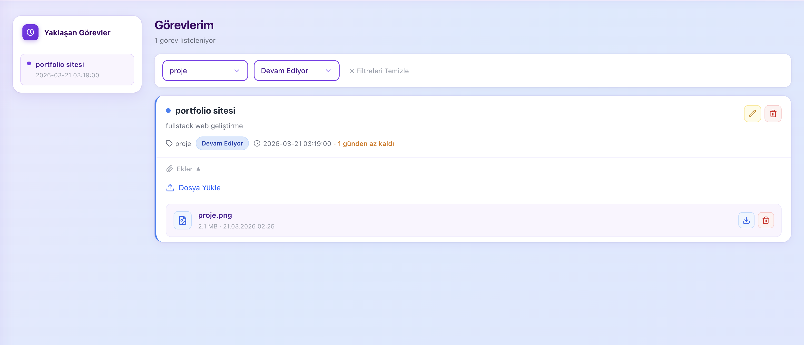
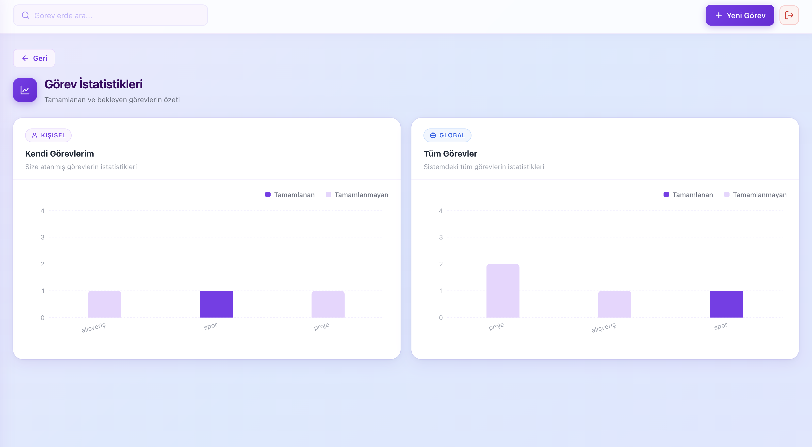

# 🚀 Task Management System

A modern full-stack task management web application that allows users to efficiently manage, track, and organize their daily tasks.

---

## 📸 Screenshots

### 🏠 Landing Page


### 🔐 Login Page


### 📝 Register Page


### 📋 Task Dashboard


### 📊 Statistics Page


### ➕ Add Task


### ✏️ Edit Task


---

## 🧑‍💻 About the Project

This project is a **full-stack task management application** developed using modern web technologies.

Users can:
- Register & login securely
- Create, edit, delete tasks
- Categorize tasks
- Track task status and deadlines
- Upload files to tasks
- View statistics of completed and pending tasks

The system is designed to be **responsive, scalable, and secure**.

---

## ⚙️ Tech Stack

### 🖥️ Frontend
- **Next.js**
- **TypeScript**
- **Tailwind CSS**

### 🛠️ Backend
- **NestJS**
- **TypeScript**
- **TypeORM**

### 🗄️ Database
- **PostgreSQL**

### 🔐 Authentication & Security
- **JWT** (JSON Web Token)
- **bcrypt** (password hashing)

### 🧰 Tools
- **Swagger** (API documentation)
- **DBeaver** (database management)
- **VS Code**

---

## ✨ Features

- 🔐 Authentication (Login/Register)
- 👤 User-based task management
- 📝 Create / Edit / Delete tasks
- 📂 File upload system
- 📊 Task statistics dashboard
- 🏷️ Task categorization
- 📅 Deadline tracking
- 🔍 Filtering & search
- 📱 Fully responsive UI

---

## 🏗️ Architecture

This project follows a **3-layer architecture**:
```text
Frontend (Next.js)
        ↓
Backend (NestJS API)
        ↓
Database (PostgreSQL)
```

- Frontend handles UI and user interaction
- Backend handles business logic and API
- Database stores user & task data

---

## 🔐 Security

- JWT-based authentication system
- Passwords are hashed using bcrypt
- Protected API routes
- Role-based structure ready

---

## 📂 Project Structure
```text
task-management-system/
├── backend/
├── frontend/
├── images/
└── README.md
```

---

## 🚀 Getting Started

### 1️⃣ Clone the repository
```bash
git clone https://github.com/derya003/task-management-system.git
cd task-management-system
```

### 2️⃣ Backend Setup
```bash
cd backend
npm install
```

Create a `.env` file:
```env
DATABASE_URL=your_database_url
JWT_SECRET=your_secret_key
```

Run the backend:
```bash
npm run start:dev
```

### 3️⃣ Frontend Setup
```bash
cd frontend
npm install
npm run dev
```

---

## 📊 API Documentation

Swagger available at:
```
http://localhost:3001/api/docs
```

---

## 🎯 Project Goal

To provide a simple yet powerful tool for managing tasks efficiently in daily life, while demonstrating full-stack development skills.

---

## 📌 Future Improvements

- [ ] 🔔 Notifications system
- [ ] ⚡ Real-time updates (WebSocket)
- [ ] 📌 Drag & drop Kanban board
- [ ] 🌐 Deployment (Vercel + Railway)

---

## 👩‍💻 Author

**Derya Durgun**

---

## ⭐ Support

If you like this project, don't forget to ⭐ the repository!